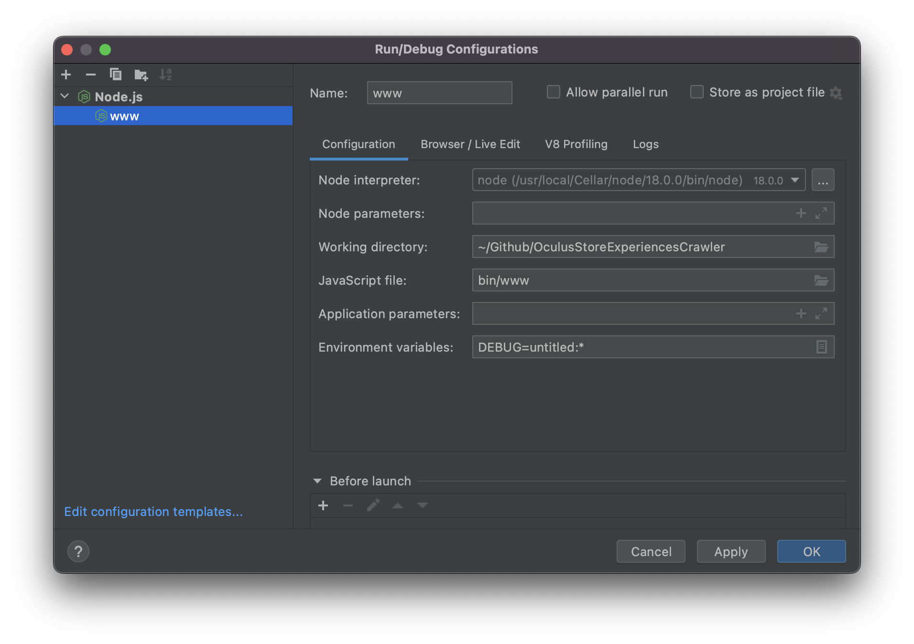
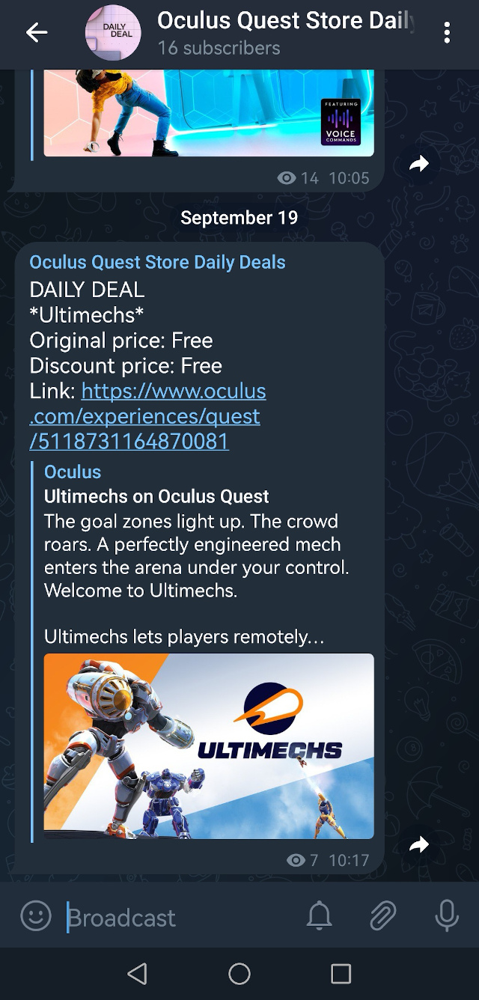

# OculusStoreExperiencesCrawler

Crawls and searches for pages found on Oculus Store main page.<br>
Stores daily deals in the database and publishes them on the Telegram's dedicated channel.

# Project's Run/Debug Configuration

Instruction how to configure the project.


# Configuring  TelegramBot

1. Create Telegram bot through Telegram
1. Copy obtained token to:

```
const TELEGRAM_BOT_TOKEN = 'XXXXXXXXXXXXXXXXX';
```

# Configuring TelegramChannel

1. Create Telegram channel through Telegram
1. Get id of you newly created channel
1. Copy obtained token to:

```
const TELEGRAM_CHANNEL_ID = "@XXXXXXXXXXXXXXXXX";
```

# Running the project

1. Being in the project's folder execute the below command (or click the green triangle in PhpStorm IDE):

```
npm start
```

2. Open the browser and enter url:

```
127.0.0.1:3000
```

**Note: Fetching might take a while. Just wait till you get a JSON response about finished work.

# Sample of  Telegram's channel

